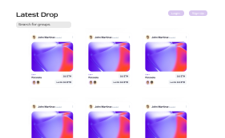

# Create and Sell NFT

## Overview
The website allows you to upload any picture / existing art you have and turns it into NFT that can be sold or exchanged on the marketplace. <br>
Strech goal: allow users to bid for the price of the artwork

## Data Model
The application will store Users, Lists, Art Items for Sale

* Users can have private Art Items that are not open to the public
* There can be multiple lists depending on the category of the Art
* Users can decide which List to display their Art

An Example User:
  
 ```js  
 {
    username: "conartist",
    hash: // password hash,
    lists: // an array of Art,
    wallet: // address of the wallet to receive payment
    artSold: // popularity of the Artist
}
```
An Example Art:
```js
{
    user: // reference to the User object
    title: "coffee with milk", 
    createdAt: // timestamp
    category: // an arry of references to List object
    price: // listed price
    public: true, // whether this can be viewed by the public
    sold: false // whether this has been sold
}
```
An Example List with Embedded Art:
```js
{
    name: "random" 
    items: [
      {user: "conartist", name: "coffee with milk" ... sold: false}, // An array of reference to the Art Object
    ]
}
```
#### [Link to Commented First Draft Schema](./db.js)

## Wireframes
/home - page for users to see all the art/drops, and search art/drops by their groups <br>
 <br>

/login - page for registered users to log in to the site<br>
 <br>

/signup - page for users to register <br>
 <br>

/create - page for registered users to create art/drops<br>
 <br>

/bid/?art_id - page for users to see specific art/drop, place a bid and see the past bid history <br>
 <br>


## User Stories
1. Non-registered users register for an account with the site
2. Users log in to the site
3. Users upload art work, set a price, or make it private from viewing
4. Non-registered users and users can both view all of the art items available on the site
5. Non-registered users and users can find different groups of art items on the site

## Research Topics
* (5 points) Using Passport for user authentication
    * Passport provides hashing function to hash user password, this ensures security of the website so the user information will not be leaked to unauthorized admin users
* (5 points) Using Solidity to accept crypto payments 
    * Solidity provides smart contract for payment
    * Solidity frameworks handle payment and bidding for the art/drops
* (5 points) front-end React Native framework
    * React Native provides multi-platform front-end components that I can use for login, signup 
* (3 points) Using Multer to upload files to MongoDB

## Annotations / References Used
1. [Middleware and Form Coding Demo](https://cs.nyu.edu/courses/fall21/CSCI-UA.0467-001/_site/examples/class09/middleware-forms.zip) - boilerplate referenced to start app.js
2. [Solidity tutorial](https://solidity-by-example.org/payable/) - shows how to incorporate Solidity payment framework in JavaScript

### [Link to initial main project file](./app.js)

